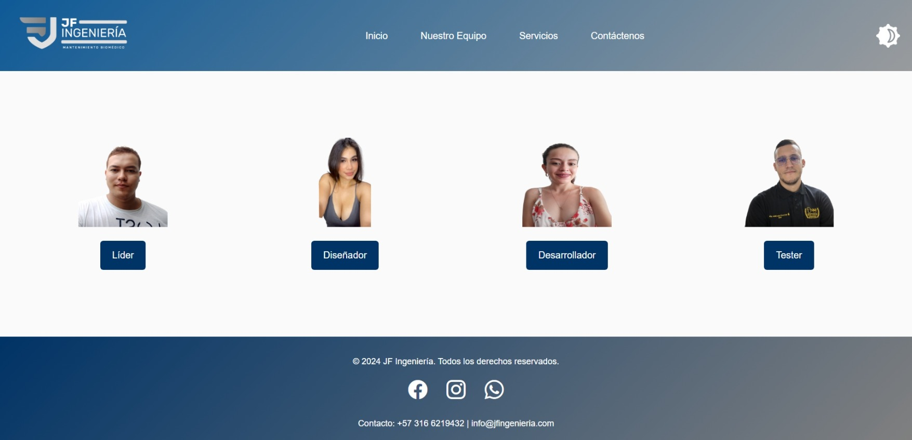

# jfingenieria-web

Proyecto web desarrollado para la empresa **J.F. Ingeniería y Soluciones S.A.S.** como parte del curso de programación de Talento Tech. El objetivo fue crear una página web moderna, visualmente atractiva y funcional, que facilite la gestión y presentación de servicios relacionados con equipos biomédicos.

---

## Tabla de Contenidos
- [Descripción General](#descripción-general)
- [Tecnologías Utilizadas](#tecnologías-utilizadas)
- [Estructura del Proyecto](#estructura-del-proyecto)
- [Mockups y Proceso de Diseño](#mockups-y-proceso-de-diseño)
- [Instrucciones de Uso](#instrucciones-de-uso)
- [Créditos](#créditos)
- [Licencia](#licencia)

---

## Descripción General

Este proyecto consiste en un sitio web informativo que incluye:

- Un carrusel interactivo en la página principal.
- Secciones informativas sobre la empresa y su equipo.
- Formulario de contacto.
- Páginas de perfil para los miembros del equipo.
- Página de inicio de sesión y términos legales.
- Diseño responsivo y visual atractivo, orientado a mejorar la experiencia del usuario.

## Tecnologías Utilizadas

- **HTML5**: Estructura y contenido de las páginas.
- **CSS3**: Estilos, diseño responsivo y animaciones.
- **JavaScript**: Interactividad, validaciones y funcionalidades dinámicas.

## Estructura del Proyecto

```
jfingenieria-web/
│
├── css/                # Hojas de estilo CSS para cada sección y vista
├── img/                # Imágenes utilizadas en la web (logos, fotos, íconos, etc.)
├── js/                 # Scripts JavaScript para funcionalidades como el carrusel y formularios
├── mockup/             # Imágenes de referencia de las vistas y prototipos iniciales
│   └── figma/          # Modelos iniciales diseñados en Figma
├── vistas/             # Páginas HTML de las diferentes secciones del sitio
├── index.html          # Página principal
└── README.md           # Documentación del proyecto
```

## Mockups y Proceso de Diseño

A continuación se muestran las imágenes de referencia de las vistas principales del proyecto, ubicadas en la carpeta `mockup/`:

### Mockups de Vistas





### Prototipos Iniciales (Figma)

En la subcarpeta `mockup/figma/` se encuentran los modelos iniciales realizados en Figma:


Estos recursos documentan el proceso de diseño, desde la conceptualización hasta la implementación final.

## Instrucciones de Uso

1. **Clonar el repositorio**  
   Puedes clonar este proyecto usando el siguiente comando en tu terminal o consola:

   ```bash
   git clone https://github.com/pamelamichellga01/jfingenieria-web.git
   ```

2. **Abrir el proyecto**  
   Abre el archivo `index.html` en tu navegador preferido para visualizar la página principal.

3. **Navegación**  
   Utiliza el menú y los enlaces para explorar las diferentes secciones: equipo, servicios, contacto, perfiles, login, términos legales, etc.

## Créditos

- **Desarrollado por:** Pamela Michell Galvis Álvarez
- **Empresa:** J.F. Ingeniería y Soluciones S.A.S.
- **Curso:** Talento Tech - Programación

## Licencia

Este proyecto es de uso educativo y puede ser reutilizado o adaptado para fines académicos o empresariales.

---

Repositorio oficial: [https://github.com/pamelamichellga01/jfingenieria-web.git](https://github.com/pamelamichellga01/jfingenieria-web.git)
